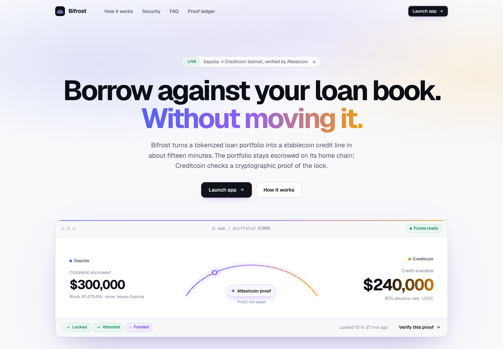
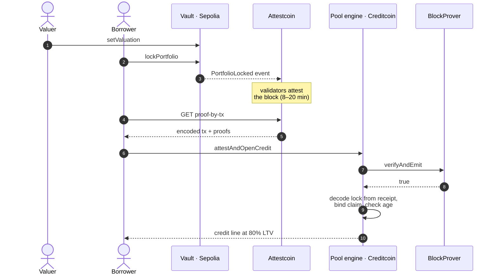
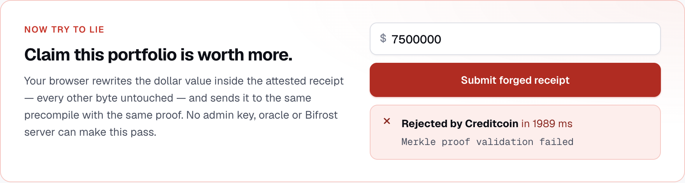
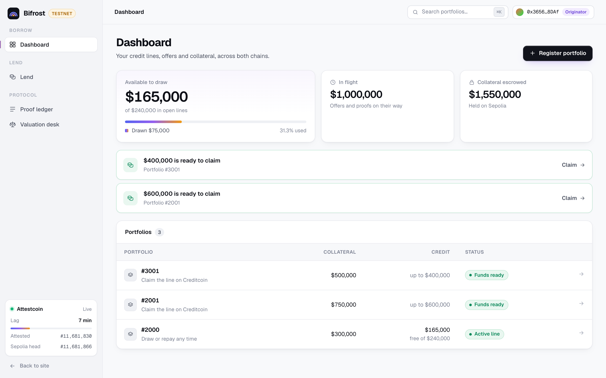
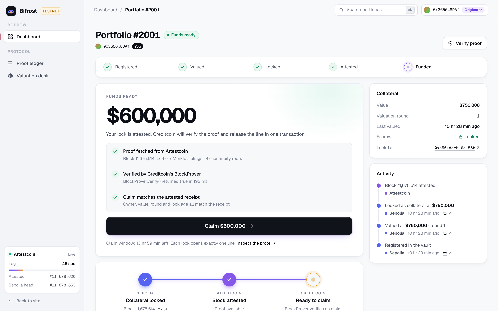
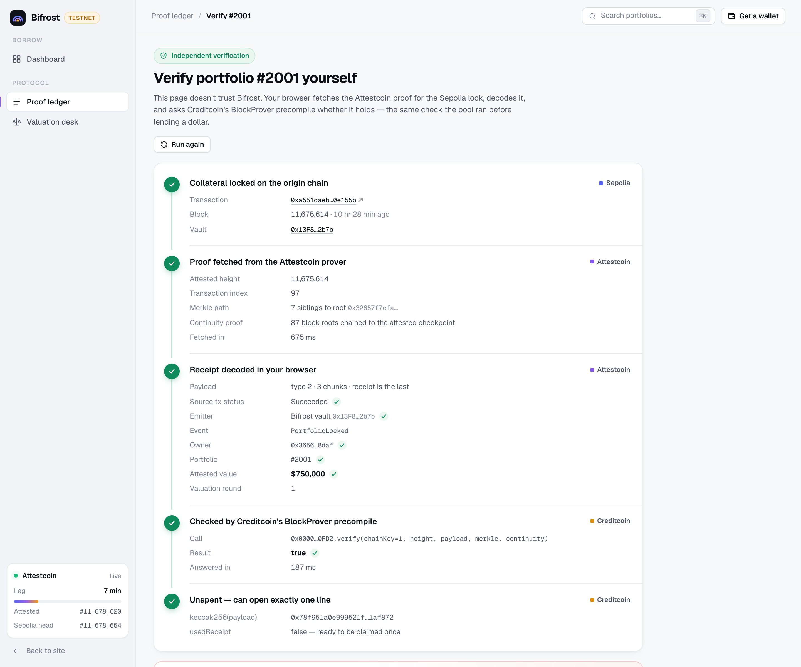
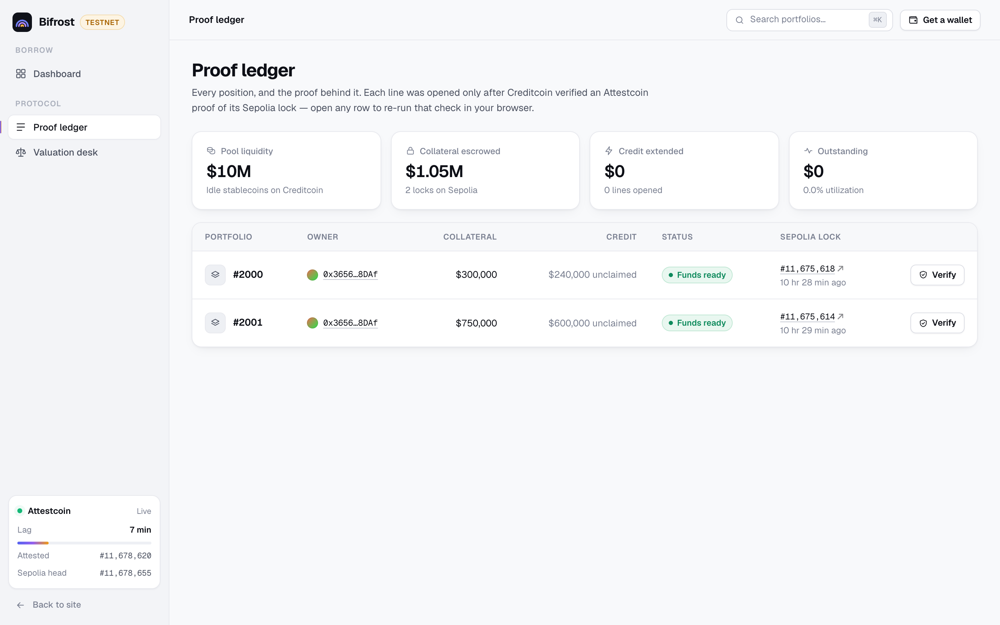
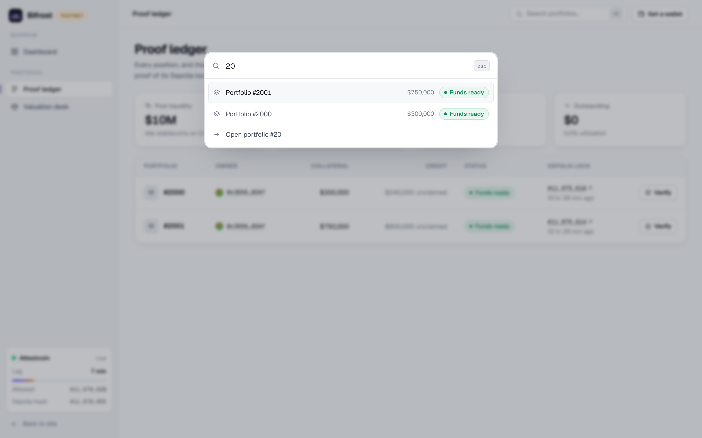
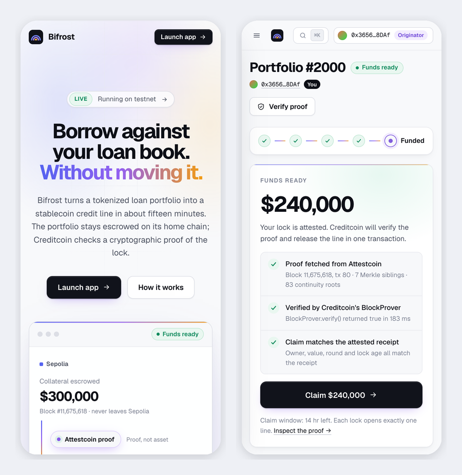

<p align="center">
  
</p>

<h1 align="center">Bifrost</h1>

<p align="center">
  <strong>Borrow against your loan book. Without moving it.</strong><br />
  Cross-chain private credit, proven by Attestcoin and funded on Creditcoin.
</p>

<p align="center">
  
  
  
  
</p>

<p align="center">
  
</p>

Real-world-asset lenders keep their tokenized loan books on compliance chains. The
liquidity they want is on Creditcoin. Today the only way across is a bridge, meaning a
multisig, an oracle and a custodian: exactly the trust that institutional risk officers
won't sign off on.

**Bifrost doesn't move the asset. It moves a proof about the asset.** The portfolio is
locked in escrow on its home chain. Attestcoin attests the block containing that lock.
Creditcoin's `BlockProver` precompile verifies the proof on-chain, and the pool releases
a stablecoin credit line at up to 80% of the attested value. No bridge, oracle or
committee sits in the trust path, and the collateral value itself comes out of the
proven receipt, never out of the borrower's calldata.

<p align="center">
  
  <br /><sub>Landing → dashboard → claim checks → proof re-verified in the browser → a forged receipt rejected by Creditcoin. Every frame is live testnet data.</sub>
</p>

---

## Contents

- [Why it matters](#why-it-matters)
- [How it works](#how-it-works)
- [Attestcoin integration](#attestcoin-integration)
- [Security model: try to break it](#security-model-try-to-break-it)
- [Product tour](#product-tour)
- [Live deployment](#live-deployment)
- [Run it](#run-it)
- [Repository layout](#repository-layout)
- [Business model](#business-model)
- [Known gaps and what's next](#known-gaps-and-whats-next)

---

## Why it matters

|  | Traditional private credit | Bridged DeFi lending | **Bifrost** |
|---|---|---|---|
| Time to funds | 3–6 months | Minutes | **~15 minutes** |
| Collateral leaves its chain | No, it's on paper | Yes, wrapped | **Never** |
| What you trust | Lawyers and custodians | A bridge multisig | **A proof anyone can check** |
| Who prices collateral | The lender | A price oracle | **An independent valuer, on-chain** |

**0 bridges · 0 oracles · 0 multisigs · 1 proof.**

## How it works



| # | Layer | Chain | Code |
|---|---|---|---|
| 1 | **Escrow.** Originators register portfolios, *independent valuers* price them, owners lock them. Locking requires a fresh valuation (≤ 7 days). | Sepolia | [`RWAOriginVault.sol`](contracts/src/RWAOriginVault.sol) |
| 2 | **Proof.** Attestcoin attests the block. The prover serves a Merkle inclusion proof plus a continuity proof back to the attested checkpoint. | Attestcoin | [`sdk/src/attest.ts`](sdk/src/attest.ts), [`app/src/lib/prover.ts`](app/src/lib/prover.ts) |
| 3 | **Credit.** The engine verifies the proof via the precompile, decodes `PortfolioLocked` from the receipt, and opens a line at 80% LTV. | Creditcoin | [`CreditcoinPoolEngine.sol`](contracts/src/CreditcoinPoolEngine.sol), [`AttestedTx.sol`](contracts/src/lib/AttestedTx.sol) |

## Attestcoin integration

Attestcoin sits in the credit decision itself. The protocol touches every part of its
surface, both on-chain and from the browser:

| Attestcoin surface | How Bifrost uses it |
|---|---|
| **BlockProver** `verifyAndEmit` | The gate on every credit line, called inside `attestAndOpenCredit`. No `true`, no money. |
| **BlockProver** `verify` | A free dry-run in `previewIngest` before the borrower signs, and in-browser re-verification of any position by anyone. |
| **ChainInfo** `get_latest_attestation_height_and_hash` | **Lock freshness, on-chain.** The engine rejects a proof whose lock the attestation frontier left more than `maxLockAge` blocks behind (`LockTooOld`). |
| **ChainInfo** `is_height_attested` | The signal to start proving, in the SDK and the portal. The claim button waits on it, not on a timer. |
| **ChainInfo** `get_supported_chains` | Which source chains are actually attested, read live on the landing page and by `bifrost status`. |
| **Prover API** `proof-by-tx` | Merkle and continuity proofs, via `@gluwa/usc-sdk`'s `ProofBuilder` in the SDK and fetched directly by the browser (CORS `*`), so the portal needs no backend. |
| **Attestation lag** | Frontier vs. Sepolia head, measured every 15 s, drives the sidebar widget and every ETA. No fake progress bars. |

### Things we verified against the live network, not the docs

- **`encodedTransaction` is an ABI envelope, not receipt RLP**: `abi.encode(uint8 txType, bytes[] chunks)`, where the **last** chunk is the receipt, itself ABI-encoded with its logs. Getting this wrong passes your own fixtures and fails only on real proofs. [`AttestedTx.sol`](contracts/src/lib/AttestedTx.sol) takes the last chunk, so it works for every tx type (3 chunks for legacy and 1559, 4 for blob and 7702). It is tested against a [**real attested Sepolia receipt**](contracts/test/fixtures/sepolia-attested-tx.hex).
- **Struct field order in `MerkleProof` is load-bearing.** We confirmed it by differential calls: the right order dispatches (`"Transaction data cannot be empty"`), a transposed order returns `"Unknown selector"`.
- **ChainInfo is snake_case.** `getSupportedChains()` returns `Unknown selector` and looks like a missing precompile.
- **Reverted source transactions are still attestable.** The engine checks receipt `status`, or a failed lock could fund a line (`SourceTxFailed`).
- **CC3's EVM is pre-merge.** Contracts compile for `london`; `paris`+ fails with `prevrandao not set`.
- **Only Ethereum (key 3) and Sepolia (key 1) are attested**, per `get_supported_chains()`. That's why the origin chain is Sepolia and not Base or Plume.

## Security model: try to break it

The collateral value is **never** taken from calldata. `LockClaim` only *locates* the log
in the proven receipt, and every field must match what the receipt says.

| Attack | Defense | Revert |
|---|---|---|
| Inflate the collateral value | Value decoded from the verified receipt, not the claim | `ClaimDoesNotMatchProof` |
| Forge or tamper with the receipt | Merkle + continuity proof checked by the precompile | `ProofRejected` |
| Price your own collateral | Originator and valuer are separate vault roles | `NotValuer` |
| Lock against an old valuation | Vault rejects valuations older than `maxValuationAge` (7 days) | `StaleValuation` |
| Sit on a proof, borrow later | Lock aged against the ChainInfo frontier (`maxLockAge` 7,200 blocks) | `LockTooOld` |
| Reuse a receipt for a second line | `keccak256(encodedTx)` consumed on first use | `ReceiptAlreadyUsed` |
| Use a reverted lock transaction | Receipt `status` must be 1 | `SourceTxFailed` |
| Claim someone else's lock | Borrower must be `msg.sender` and the proven owner | `BorrowerMismatch`, `ClaimDoesNotMatchProof` |
| Log from a look-alike contract | Only `PortfolioLocked` emitted by the configured vault counts | `LockLogNotFound` |
| Proof from another chain | `chainKey` pinned at deploy | `BadChainKey` |
| Over-lend | LTV hard-capped at 80%; freshness windows tunable but never switchable off | `LtvTooHigh`, `BadLockAge` |

**Don't take our word for it.** Open any position's verify page and your browser
fetches the proof, decodes the receipt, and asks the precompile itself. Then rewrite the
dollar value in the attested receipt, leaving every other byte untouched, and submit it:

<p align="center">
  
</p>

## Product tour

The portal is a static React app that reads both chains over RPC and calls the prover
directly, with no backend. Every number you see comes from the chains.

<table>
  <tr>
    <td width="50%"></td>
    <td width="50%"></td>
  </tr>
  <tr>
    <td><b>Dashboard.</b> Connect a wallet and Bifrost finds every portfolio it owns. There are no IDs to type. Offers and claimable lines surface as actions.</td>
    <td><b>Claim.</b> Before you sign, the portal fetches the proof, runs <code>BlockProver.verify</code> and the engine's <code>previewIngest</code>. Receipts are single-use, so you never discover a problem on-chain.</td>
  </tr>
  <tr>
    <td></td>
    <td></td>
  </tr>
  <tr>
    <td><b>Verify.</b> Five independent checks, all run by your browser: origin lock, prover fetch, receipt decode (mirroring <code>AttestedTx.sol</code>), precompile verdict, and receipt binding.</td>
    <td><b>Proof ledger.</b> Every lock and every line, public. For an LP it's the pool's book; for anyone else it's "every dollar is backed by a proof", made checkable one row at a time.</td>
  </tr>
  <tr>
    <td></td>
    <td></td>
  </tr>
  <tr>
    <td><b>⌘K everywhere.</b> Jump to any page or portfolio. The live attestation lag stays visible in the sidebar, so an 8–20 minute wait reads as normal, not broken.</td>
    <td><b>Mobile-ready.</b> The same flows at 390px, including the lifecycle stepper and the claim checks.</td>
  </tr>
</table>

Also included: a **valuation desk** for independent valuers (a freshness-ranked queue),
transaction toasts that survive navigation, automatic chain switching (it adds CC3 to
your wallet on first use), and a live **proof-in-transit** view driven by the real
attestation frontier.

## Live deployment

Deployed 2026-09-10. Full record in [`docs/addresses.md`](docs/addresses.md).

| Contract | Chain | Address |
|---|---|---|
| `RWAOriginVault` | Sepolia (11155111) | [`0x13F8630216EeF192ea74fc2AfA47Bd9edA372b7b`](https://sepolia.etherscan.io/address/0x13f8630216eef192ea74fc2afa47bd9eda372b7b#code) (verified) |
| `CreditcoinPoolEngine` | Creditcoin CC3 (102031) | [`0x33280d3558B174563a1CDd6590640Dd1C7e41a32`](https://creditcoin-testnet.blockscout.com/address/0x33280d3558B174563a1CDd6590640Dd1C7e41a32) |
| `TestUSDC` (pool: 10,000,000) | Creditcoin CC3 | [`0x6C1e351d926E45Bf88CbdA0412C8831E40AF865B`](https://creditcoin-testnet.blockscout.com/address/0x6C1e351d926E45Bf88CbdA0412C8831E40AF865B) |
| BlockProver / ChainInfo | Creditcoin CC3 | `0x…0FD2` / `0x…0FD3` (Attestcoin precompiles) |

**Proven end to end on real proofs.** On the first deployment, portfolio 1042 was locked
at $250,000 on Sepolia, attested at height 11,664,110, opened a $200,000 line on
Creditcoin and drew $50,000. A replay of the same receipt was rejected. The decoder needed
no changes for a genuine Sepolia receipt. On the current deployment, portfolios 2000
($300k) and 2001 ($750k) are locked, attested and verify live. They are the claimable
demo positions in the portal.

## Run it

**Prerequisites:** Node 18+, [Foundry](https://book.getfoundry.sh/).

```bash
# Portal: points at the live deployment by default
cd app && npm install && npm run dev        # → http://localhost:5173
```

Open `#/verify/2001` to watch your browser verify a real Attestcoin proof, no wallet
needed.

```bash
# Contracts
cd contracts
forge build
forge test                                  # 55 tests, incl. a real attested Sepolia receipt

# SDK / CLI: the full lifecycle from a terminal
cd sdk && npm install
npm run bifrost -- status                   # attested chains + live attestation lag
npm run bifrost -- lock 3001 500000         # register, value (valuer key), lock on Sepolia
npm run bifrost -- open <lockTxHash>        # wait for attestation, prove, dry-run, open
npm run bifrost -- draw 3001 100000
npm run bifrost -- line 3001
```

The SDK and deploy scripts read `.env` (copy [`.env.example`](.env.example)). Signers are
encrypted Foundry keystores, and the valuer uses a **separate** key from the borrower.
Deploying from scratch is covered in [`docs/DEPLOYMENT.md`](docs/DEPLOYMENT.md). For a
smooth demo, set `VITE_SEPOLIA_RPC_URL` to a dedicated endpoint; the public one caps
`eth_getLogs` ranges.

## Repository layout

```
contracts/          Foundry project (via_ir, evm_version = london)
  src/RWAOriginVault.sol          escrow + role separation + valuation freshness
  src/CreditcoinPoolEngine.sol    proof-gated credit lines, draw, repay
  src/lib/AttestedTx.sol          decoder for Attestcoin's encoded-tx envelope
  src/interfaces/                 BlockProver + ChainInfo precompile interfaces
  test/                           55 tests; fixtures/ holds a real attested receipt
sdk/                TypeScript CLI: lock → wait for attestation → prove → open → draw
app/                React + viem portal, no backend
  src/lib/indexer.ts              browser-side event indexer over both chains
  src/lib/proof.ts                receipt decoder mirroring AttestedTx.sol + forge demo
  src/lib/phase.ts                one lifecycle state machine every screen reads
docs/               addresses, deployment runbook, screenshots
```

## Business model

Bifrost is asset-light middleware. It never lends its own balance sheet.

- **Origination fee:** 0.25–0.50% of line value at execution (a $10M line earns $25–50k).
- **Rate spread:** LPs earn about 6%, borrowers pay about 8%, and the protocol keeps roughly 2%.
- **Attestation and settlement fees:** per cross-chain message, shared with validator incentives.

**Go-to-market.** Supply comes from RWA tokenization platforms (Plume, Centrifuge,
Goldfinch) whose compliant originators want cheaper liquidity. Demand comes from the
Gluwa and Creditcoin ecosystems routing stablecoins into real yield. Every lock,
attestation and drawdown is on-chain activity for Creditcoin, and it pulls RWA liquidity
that is stranded on other chains.

## Known gaps and what's next

We'd rather list these than have you find them:

- **Sepolia is the only origin chain**, because it's the only testnet Attestcoin attests. Base and Plume become config changes once Attestcoin supports them.
- **Unlocking is admin-gated.** Creditcoin repayment isn't yet proven back to Sepolia. *Next:* a symmetric Creditcoin → origin attestation to release escrow trustlessly.
- **No interest accrual, health factor or liquidation yet.** The LTV buffer is enforced at open only. *Next:* re-attested valuations that halt drawdowns automatically below a threshold.
- **The portal is unaudited and has no test suite.** Its read paths and pre-flight checks are verified against the live deployment. Lines have been opened and drawn via the SDK, but not yet from the portal UI.
- **Production needs** KYC/AML partners and institutional custody (Fireblocks, BitGo).

## License

[Apache-2.0](LICENSE)
